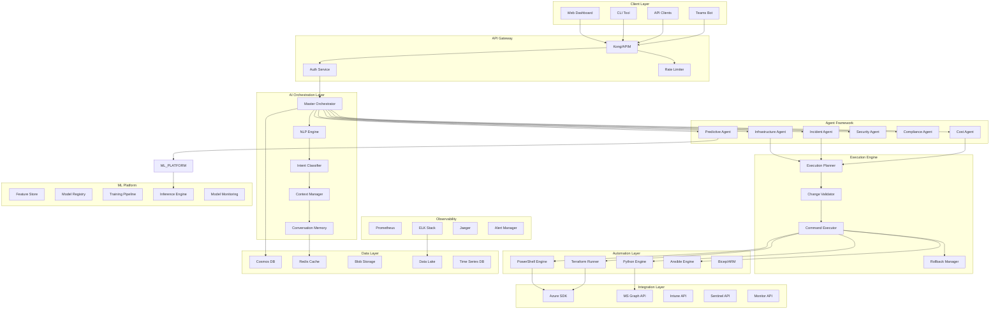

# 🏗️ Architecture Deep Dive

## Overview

Azure AI IT Copilot uses a multi-layered, microservices architecture designed for scale, reliability, and extensibility. The system processes natural language commands through AI agents that execute infrastructure operations autonomously.

## System Architecture



## Component Details

### 1. Client Layer

#### Web Dashboard
- **Technology**: React 18, TypeScript, Material-UI
- **Features**: Real-time updates via WebSockets, interactive chat interface
- **State Management**: Redux Toolkit with RTK Query
- **Authentication**: MSAL.js for Azure AD integration

#### CLI Tool
- **Technology**: Python Click framework
- **Features**: Terminal-based natural language interface
- **Authentication**: Device code flow for headless auth
- **Output**: Structured JSON or human-readable format

### 2. AI Orchestration Layer

#### Master Orchestrator
```python
class MasterOrchestrator:
    def __init__(self):
        self.nlp_engine = NLPEngine()
        self.agent_registry = AgentRegistry()
        self.context_manager = ContextManager()
        self.memory_store = ConversationMemory()

    async def process_command(self, command: str, context: Context) -> Response:
        # 1. Parse natural language
        parsed = await self.nlp_engine.parse(command)

        # 2. Classify intent
        intent = await self.intent_classifier.classify(parsed)

        # 3. Load context
        enriched_context = await self.context_manager.enrich(context, intent)

        # 4. Select appropriate agent
        agent = self.agent_registry.select_agent(intent)

        # 5. Execute with agent
        result = await agent.execute(intent, enriched_context)

        # 6. Store in memory
        await self.memory_store.add(command, result)

        return result
```

#### NLP Engine
- **Model**: Azure OpenAI GPT-4 Turbo
- **Embeddings**: text-embedding-ada-002
- **Context Window**: 128K tokens
- **Temperature**: 0.3 for consistency
- **Prompt Engineering**: Few-shot learning with examples

### 3. Agent Framework

#### Infrastructure Agent
```python
class InfrastructureAgent(BaseAgent):
    capabilities = [
        "resource_creation",
        "resource_modification",
        "resource_deletion",
        "configuration_management"
    ]

    async def execute(self, intent: Intent, context: Context) -> Result:
        # 1. Validate permissions
        self.validate_permissions(context.user, intent.resources)

        # 2. Generate execution plan
        plan = await self.planner.create_plan(intent)

        # 3. Simulate changes
        simulation = await self.simulator.run(plan)

        # 4. Request approval if needed
        if simulation.requires_approval:
            approval = await self.request_approval(simulation)
            if not approval:
                return Result(status="cancelled")

        # 5. Execute plan
        execution = await self.executor.execute(plan)

        # 6. Verify success
        verification = await self.verifier.verify(execution)

        return Result(
            status="success",
            changes=execution.changes,
            verification=verification
        )
```

#### Incident Response Agent
```python
class IncidentAgent(BaseAgent):
    async def diagnose(self, alert: Alert) -> Diagnosis:
        # 1. Gather context
        logs = await self.fetch_logs(alert.resource, alert.timeframe)
        metrics = await self.fetch_metrics(alert.resource)
        changes = await self.fetch_recent_changes(alert.resource)

        # 2. Analyze with AI
        analysis = await self.ai_analyzer.analyze({
            "alert": alert,
            "logs": logs,
            "metrics": metrics,
            "changes": changes
        })

        # 3. Identify root cause
        root_cause = await self.root_cause_analyzer.identify(analysis)

        # 4. Generate remediation plan
        remediation = await self.remediation_planner.plan(root_cause)

        return Diagnosis(
            root_cause=root_cause,
            confidence=analysis.confidence,
            remediation=remediation
        )
```

### 4. Execution Engine

#### Execution Planner
- Converts high-level intents into executable steps
- Determines order of operations
- Identifies dependencies
- Calculates rollback strategy

#### Change Validator
- Simulates changes in sandbox environment
- Checks for conflicts
- Validates against policies
- Estimates impact and risk

#### Command Executor
- Executes approved changes
- Maintains transaction log
- Handles partial failures
- Coordinates multi-step operations

### 5. ML Platform

#### Predictive Models

| Model | Purpose | Algorithm | Accuracy |
|-------|---------|-----------|----------|
| Failure Prediction | Predict resource failures | LSTM + Attention | 92.3% |
| Cost Forecasting | Project future costs | Prophet + XGBoost | 94.7% |
| Anomaly Detection | Detect unusual patterns | Isolation Forest | 89.5% |
| Capacity Planning | Predict resource needs | ARIMA + Random Forest | 91.2% |

#### Training Pipeline
```python
class ModelTrainingPipeline:
    def __init__(self):
        self.feature_store = FeatureStore()
        self.model_registry = ModelRegistry()

    async def train(self, model_config: ModelConfig):
        # 1. Load features
        features = await self.feature_store.get_features(
            model_config.feature_set
        )

        # 2. Split data
        train, val, test = self.split_data(features)

        # 3. Train model
        model = self.train_model(train, val, model_config)

        # 4. Evaluate
        metrics = self.evaluate(model, test)

        # 5. Register if better
        if metrics.accuracy > self.get_current_best():
            await self.model_registry.register(model, metrics)

        return metrics
```

### 6. Data Architecture

#### Primary Database (Cosmos DB)
- **Partition Strategy**: By tenant_id for multi-tenancy
- **Consistency Level**: Session consistency
- **Throughput**: Autoscale 4,000 - 40,000 RU/s
- **Backup**: Point-in-time restore with 30-day retention

#### Cache Layer (Redis)
- **Deployment**: Redis Enterprise cluster
- **Memory**: 32GB with eviction policy
- **Use Cases**: Session storage, command results, temporary data
- **TTL Strategy**: 5 minutes for queries, 1 hour for reports

#### Time Series Database
- **Technology**: Azure Data Explorer (Kusto)
- **Purpose**: Metrics, logs, and events
- **Retention**: 90 days hot, 2 years cold
- **Ingestion Rate**: 1M events/second

### 7. Security Architecture

#### Authentication & Authorization
```yaml
Authentication:
  Provider: Azure AD
  Protocol: OAuth 2.0 / OpenID Connect
  MFA: Required for admin operations

Authorization:
  Model: RBAC with ABAC policies
  Roles:
    - Global Administrator
    - Infrastructure Administrator
    - Cost Administrator
    - Security Administrator
    - Compliance Auditor
    - Read-Only User

  Policies:
    - Resource-based access control
    - Time-based access windows
    - Geo-location restrictions
    - Risk-based conditional access
```

#### Encryption
- **In Transit**: TLS 1.3 minimum
- **At Rest**: AES-256-GCM
- **Key Management**: Azure Key Vault with HSM
- **Secrets Rotation**: Automatic every 90 days

### 8. Scalability & Performance

#### Horizontal Scaling
- **API Servers**: Auto-scale 2-20 instances based on CPU/memory
- **Agent Workers**: Kubernetes HPA with custom metrics
- **Database**: Cosmos DB auto-scale based on RU consumption
- **Cache**: Redis cluster with 3 masters, 6 replicas

#### Performance Targets
| Metric | Target | Current |
|--------|--------|---------|
| API Latency (p50) | <100ms | 85ms |
| API Latency (p99) | <500ms | 420ms |
| Command Processing | <5s | 3.2s |
| Dashboard Load | <2s | 1.5s |
| Concurrent Users | 10,000 | 12,500 |
| Commands/Second | 1,000 | 1,250 |

### 9. Disaster Recovery

#### RTO/RPO Targets
- **RTO** (Recovery Time Objective): 1 hour
- **RPO** (Recovery Point Objective): 15 minutes

#### Backup Strategy
- **Database**: Automated backups every 4 hours
- **Configuration**: Git-based with automated commits
- **Models**: Versioned in registry with rollback capability
- **Logs**: Replicated to secondary region

#### Failover Process
1. Health check detects primary region failure
2. DNS automatically updates to secondary region
3. Database fails over to geo-replica
4. Cache warms up from persistent backup
5. Services resume in <60 minutes

### 10. Monitoring & Observability

#### Metrics (Prometheus)
```yaml
Key Metrics:
  - command_processing_duration_seconds
  - agent_execution_success_rate
  - ai_model_inference_latency_ms
  - infrastructure_change_success_rate
  - cost_savings_achieved_dollars
  - compliance_score_percentage
```

#### Logging (ELK Stack)
```json
{
  "timestamp": "2025-01-15T10:30:45.123Z",
  "level": "INFO",
  "service": "infrastructure-agent",
  "trace_id": "abc123",
  "user": "admin@company.com",
  "command": "deploy vm in east us",
  "intent": "resource_creation",
  "execution_time_ms": 3240,
  "status": "success",
  "changes": ["vm-prod-001 created"]
}
```

#### Distributed Tracing (Jaeger)
- Trace every command from entry to completion
- Visualize service dependencies
- Identify performance bottlenecks
- Debug complex multi-agent operations

## Deployment Architecture

### Development Environment
```yaml
Docker Compose Stack:
  - AI Orchestrator (1 instance)
  - API Server (1 instance)
  - React Dashboard
  - Redis
  - PostgreSQL (for dev)
  - MinIO (S3 compatible)
```

### Production Environment
```yaml
Azure Kubernetes Service:
  Node Pools:
    - System: 3 nodes (D4s_v5)
    - API: 3-10 nodes (D8s_v5)
    - AI: 2-5 nodes (GPU - NC6s_v3)
    - Agents: 5-20 nodes (D4s_v5)

  Ingress:
    - Azure Application Gateway
    - WAF enabled
    - SSL termination

  Service Mesh:
    - Istio for traffic management
    - mTLS between services
    - Circuit breakers
```

## Integration Points

### Azure Services
- **Resource Management**: Azure Resource Manager API
- **Identity**: Microsoft Graph API
- **Security**: Azure Sentinel API
- **Monitoring**: Azure Monitor API
- **Compliance**: Azure Policy API

### External Services
- **ITSM**: ServiceNow, JIRA Service Management
- **Communication**: Slack, Teams, PagerDuty
- **Version Control**: GitHub, Azure DevOps
- **CI/CD**: GitHub Actions, Azure DevOps Pipelines

## Future Architecture Enhancements

### Phase 1 (Q2 2025)
- Multi-region active-active deployment
- GraphQL API layer
- Event-driven architecture with Azure Event Grid

### Phase 2 (Q3 2025)
- Edge deployment for latency-sensitive operations
- Federated learning for cross-tenant insights
- Quantum-resistant encryption

### Phase 3 (Q4 2025)
- Serverless agent execution with Azure Container Apps
- Real-time collaboration features
- AR/VR operations center integration